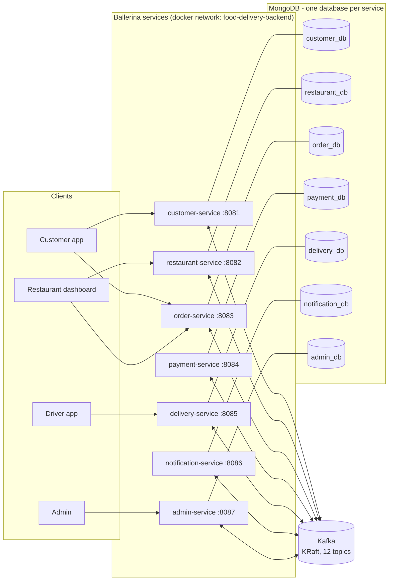
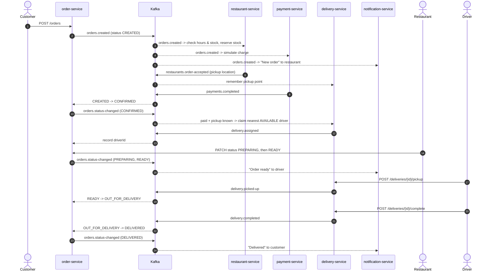
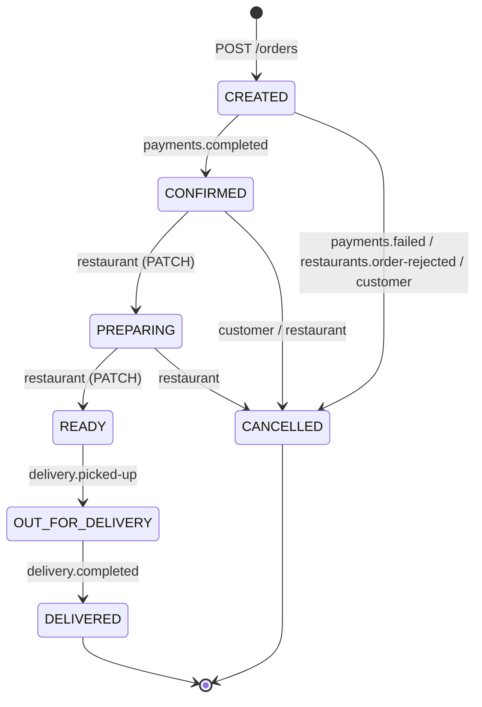

# Architecture

## System overview

Seven Ballerina microservices. They talk to each other **only through Kafka**:
no service calls another service's REST API, and no service reads another
service's database. Clients (web/mobile UI, Postman, curl) call the REST APIs.

## Order lifecycle (choreography)

There is no central orchestrator. Each service reacts to events and emits its
own. The order-service owns the state machine and is the only service that
changes an order's status.

Failure paths: `payments.failed` and `restaurants.order-rejected` both move the
order to `CANCELLED`, and `orders.cancelled` tells payment-service to refund
and restaurant-service to put the stock back.

## Order state machine

Implemented in `services/order-service/state_machine.bal`. The REST API only
lets restaurants set `PREPARING`, `READY` and `CANCELLED`. The other statuses
can only be reached through events, so (for example) nobody can mark an order
`CONFIRMED` without a payment.

## Reliability decisions

| Concern | Decision | Where |
|---|---|---|
| Ordering | Every order-scoped event is keyed by `orderId`, so one order's events stay on one partition and are consumed in order. | `producer.bal` |
| Durable publish | Producer uses `acks=all` and `enableIdempotence=true`: retries never duplicate a message. | `producer.bal` |
| No lost events | `autoCommit: false`. Offsets are committed only after a batch has been processed, so a crash replays events instead of dropping them. | `consumer.bal` |
| Duplicates (at-least-once) | Handlers are idempotent. A transition to the status the order already has is a no-op. Payment and delivery use unique indexes on `orderId`. | `order_logic.bal`, `init-mongo.js` |
| Concurrent updates | Status changes are compare-and-set: `updateOne({orderId, status: <expected>}, ...)`. If two writers race, one gets `modifiedCount == 0`, re-reads and retries. | `repository.bal` |
| Poison messages | Unparseable events go straight to `orders.dlq`. Transient failures are retried with backoff (`maxEventRetries`), then dead-lettered. Business rejections (invalid transition) are logged and skipped. | `consumer.bal` |
| Scaling | A consumer group per service. Topic partition counts (3-6) cap how many replicas can share the work: `docker compose up --scale order-service=3` (remove the fixed host port first). | `create-topics.sh` |
| Service isolation | One MongoDB database **and one Mongo user** per service; each user has `readWrite` on its own database only. | `init-mongo.js`, `docker-compose.yml` |
| Startup order | Compose healthchecks plus `depends_on: condition`: services start only after Kafka is healthy, topics exist (`kafka-init` completed) and Mongo answers pings. `restart: unless-stopped` recovers crashed services. | `docker-compose.yml` |

### Known limitation, worth discussing in the defence

`createOrder` writes to MongoDB and then publishes to Kafka. If the process
dies between the two, the order exists but no `orders.created` event goes out
(the "dual write" problem). The standard fix is a **transactional outbox**:
write the event into an `outbox` collection in the same Mongo transaction as
the order, and have a background task publish and mark outbox rows. That would
make a good extension.
